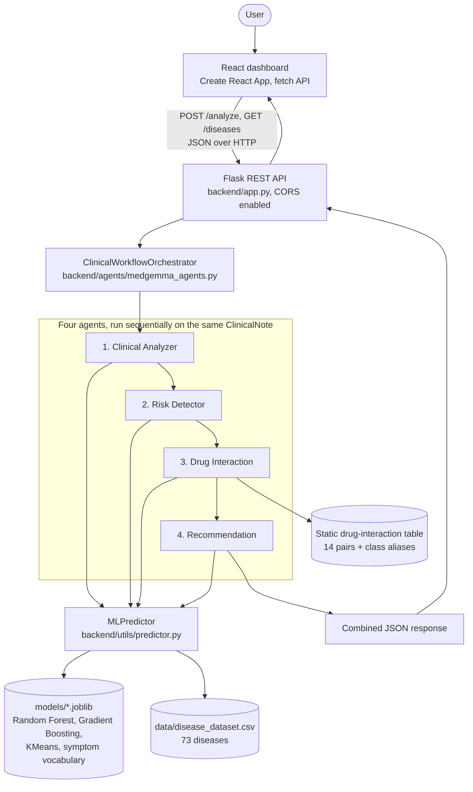
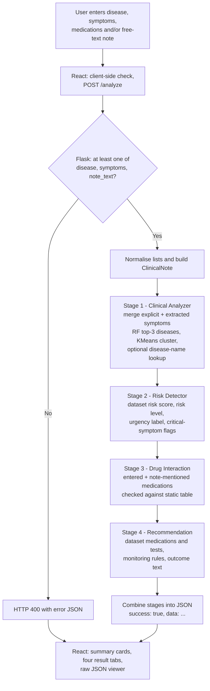

# Medora AI

Symptom-based disease analysis, risk scoring and medication-safety checks, built with a Flask + scikit-learn backend and a React dashboard.


## Overview

Medora AI takes any combination of a disease name, a list of symptoms, a current medication list and a free-text clinical note, and returns a structured analysis: the most likely diseases, related diseases, a risk level with an urgency label, a medication-interaction check, and dataset-derived medication and test suggestions. Results are shown in a React dashboard.

The backend is a Flask REST API. At startup it loads scikit-learn models that were trained from a curated CSV of 73 diseases (`data/disease_dataset.csv`) and persisted with `joblib`. A request is turned into a symptom vector (free text is matched against a 251-term symptom vocabulary), and a chain of four agent classes (Clinical Analyzer → Risk Detector → Drug Interaction → Recommendation) produces the four sections of the JSON response.

Machine learning is used for disease ranking (Random Forest) and disease grouping (KMeans). Risk scores, medication and test suggestions come from the dataset, and drug interactions come from a small static lookup table. **No LLM or generative model is used.**

## Key Features

- **Flexible input:** accepts a disease name, symptoms (list or comma-separated), medications and a free-text note, in any combination; the API returns HTTP 400 if none of disease, symptoms or note is provided.
- **Symptom extraction from text:** finds known symptoms in a free-text note using word-boundary matching against the symptom vocabulary.
- **Disease prediction:** ranks the top-3 candidate diseases with probabilities from a Random Forest trained on binary symptom vectors.
- **Disease lookup:** if a disease name is supplied and found in the dataset (case-insensitive exact or substring match), it is treated as the primary hypothesis.
- **Related-disease clustering:** a KMeans model (8 clusters) surfaces diseases with similar symptom profiles.
- **Risk assessment:** reports a 0–100 risk score, a level (Low / Medium / High / Critical), an urgency label (Routine → Emergency) and flags for ten critical symptoms such as chest pain or seizures.
- **Drug-interaction check:** checks the entered medications (plus common drug names found in the note) and, separately, the dataset's recommended medications for the primary disease against a static table of 14 interacting pairs, with class aliases such as statin, SSRI and ACE inhibitor.
- **Recommendations:** lists medications and tests from the dataset for the primary disease, plus a rule-based monitoring plan and outcome statement.
- **Disease catalogue endpoints:** list all diseases and search by name; used by the frontend for autocomplete.
- **React dashboard:** one-click example presets, summary cards, four result tabs (Clinical Analysis, Risk Assessment, Drug Safety, Medication & Tests) and a raw-JSON viewer.

## System Architecture



**Layers**

| Layer | Responsibility |
|-------|----------------|
| `frontend/` | Collects input, calls the API, renders results |
| `backend/app.py` | Flask app factory, routing, input normalisation, error handling |
| `backend/agents/` | `ClinicalWorkflowOrchestrator` and four agent classes that assemble the response |
| `backend/utils/predictor.py` | `MLPredictor`: loads persisted models once and exposes inference and dataset lookups |
| `backend/utils/ml_models.py` | Training script (data augmentation, model fitting, persistence) |
| `backend/utils/data_processor.py` | CSV loading, normalisation, symptom vocabulary, vectorisation, text extraction |

## Tech Stack

| Layer | Technology | Purpose |
|-------|------------|---------|
| Frontend | React 18 (Create React App, `react-scripts` 5.0.1) | Single-page dashboard; `fetch` for API calls; inline styles + CSS |
| Backend | Python, Flask ≥ 3.0, Flask-CORS | REST API and cross-origin access from the frontend |
| AI/ML | scikit-learn ≥ 1.3 (`RandomForestClassifier`, `GradientBoostingRegressor`, `KMeans`, `TfidfVectorizer`) | Disease classification, risk regression, clustering |
| Data processing | pandas, NumPy | Dataset loading, normalisation, feature vectors |
| Model persistence | joblib | Saving and loading trained artefacts |
| Data storage | CSV file + `.joblib` files | **No database is used** |
| Deployment | Gunicorn (listed in `requirements.txt`) | `gunicorn backend.app:app` starts the API. No Dockerfile, CI or hosting configuration is included |
| Dev tooling | Git / GitHub, `scripts/full_test.py` | Version control and an end-to-end smoke test |

## AI/ML Implementation

### Pipeline

1. **Input processing.** `/analyze` accepts symptoms and medications as arrays or comma/newline-separated strings and normalises them.
2. **Symptom extraction.** For free text, each term in the vocabulary is matched with a word-boundary regular expression (`\b<term>\b`). Explicit symptoms and extracted symptoms are merged and de-duplicated.
3. **Feature representation.** Symptoms become a binary (multi-hot) vector over the 251-term vocabulary, which is built from the dataset's symptom column plus a built-in fallback list.
4. **Training data.** Each of the 73 diseases contributes its full symptom set plus 6 random symptom subsets (1 to *n* symptoms each), giving 511 samples. Augmented risk labels receive ±5 random jitter, clipped to 0–100. This lets the classifier handle partial symptom input.
5. **Model training.** `python backend/utils/ml_models.py` trains all models with fixed seeds and saves them to `models/`.
6. **Inference.** `MLPredictor` loads the artefacts once at startup, vectorises the symptoms, and returns top-*k* diseases with probabilities and a KMeans cluster with its related diseases.
7. **Risk and recommendations.** The risk score, severity, medications and tests are read from the dataset row of the identified disease (see the note below the model table), then mapped to a level, urgency and outcome text with fixed thresholds.

### Models

| Model | Purpose | Input | Output |
|-------|---------|-------|--------|
| `RandomForestClassifier` (300 trees, `class_weight="balanced"`) | Rank candidate diseases | 251-dim binary symptom vector | Probability per disease (73 classes); top-3 returned |
| `GradientBoostingRegressor` (200 estimators, depth 4, learning rate 0.05) | Estimate a 0–100 risk score from symptoms | 251-dim binary symptom vector | Risk score (clipped to 0–100) |
| `KMeans` (k = 8) | Group diseases with similar symptom profiles | 251-dim binary symptom vector | Cluster ID → related diseases via a saved `cluster_map` |
| `TfidfVectorizer` + TF-IDF matrix | Symptom-text representation of each disease | Symptom text | Sparse matrix |

> **Implementation note:** The Risk Detector uses the dataset's `risk_score` for the identified disease. The regressor's estimate is computed in `MLPredictor.predict_from_symptoms` but is not currently included in the `/analyze` response. The TF-IDF artefacts are trained, saved and loaded, but not yet used in the inference path.

### Rule-based and lookup components

| Component | How it works |
|-----------|--------------|
| Risk level | Score ≥ 80 → Critical, ≥ 60 → High, ≥ 35 → Medium, > 0 → Low |
| Urgency | Critical → EMERGENCY, High → URGENT, Medium → SEMI-URGENT, Low → ROUTINE |
| Critical flags | Symptoms matching a list of 10 keywords, plus a flag when the identified disease has Critical severity |
| Drug interactions | Static table of 14 drug/drug-class pairs; medication names are normalised (dosage stripped, class aliases added) |
| Monitoring plan | Rules on specialty (Cardiology, Pulmonology, Endocrinology) and the presence of chest pain |
| Demographics | Regex extraction of age and gender from the note text |

## Dataset

The dataset is `data/disease_dataset.csv`. The repository does not document its original source; the code refers to it as a curated CSV. Each row describes a **disease** (not a patient).

| Property | Value |
|----------|-------|
| Records | 73 diseases (one row each, no duplicates) |
| Columns | `disease`, `symptoms`, `severity`, `risk_score`, `medications`, `tests`, `description`, `specialty` |
| Symptoms per disease | 5–8 (mean ≈ 6.5); 242 unique symptom strings in the CSV, 251 in the model vocabulary after adding fallback terms |
| Severity distribution | Medium 30, High 24, Low 15, Critical 4 |
| Risk score | Integer 15–95 (mean ≈ 52.9) |
| Specialties | 22 (e.g. Neurology 9, Endocrinology 8, Gastroenterology 6, Cardiology 5) |
| Classification labels | Disease name (73 classes) |
| Regression target | `risk_score` |
| Preprocessing | Column-name normalisation, whitespace trimming, pipe-delimited fields split into lists, integer coercion for risk score |
| Augmentation | 6 random symptom subsets per disease → 511 training samples |

## Model Performance

The repository does not ship a stored evaluation report. The training script (`backend/utils/ml_models.py`) prints metrics on a 20% held-out split. Re-running it with the fixed seed (42) and scikit-learn 1.8.0 produced:

| Model | Metric | Result |
|-------|--------|--------|
| Random Forest | Accuracy (103 held-out samples, stratified split) | 0.845 |
| Random Forest | Macro / weighted F1 | 0.82 / 0.83 |
| Gradient Boosting | Mean absolute error (risk points, 0–100 scale) | 9.73 |
| Gradient Boosting | R² | 0.691 |
| KMeans (k = 8) | Silhouette score | 0.048 |

**How to read these numbers.** The held-out samples are random symptom subsets of the same 73 disease profiles the models were trained on, so the figures show how well the models recognise partial symptom sets of *known* profiles. They are not an estimate of performance on real patients. The low silhouette score indicates weakly separated clusters, so cluster membership should be read as a loose similarity grouping. Exact values may differ slightly across scikit-learn versions.

## Application Workflow



The four stages run one after another in `ClinicalWorkflowOrchestrator.process_note`. Each agent reads the same `ClinicalNote` and queries the shared `MLPredictor`; agents do not consume each other's outputs.

## Project Structure

```text
Medora-AI/
├── backend/
│   ├── app.py                    # Flask app factory and REST routes
│   ├── agents/
│   │   └── medgemma_agents.py    # Orchestrator + 4 agent classes, drug-interaction table
│   └── utils/
│       ├── data_processor.py     # CSV loading, vocabulary, vectorisation, text extraction
│       ├── ml_models.py          # Training script (augmentation, fitting, persistence)
│       ├── predictor.py          # MLPredictor: model loading and inference
│       └── load_data.py          # Legacy helper: exports the dataset to clinical_notes.json
├── frontend/
│   ├── public/index.html
│   ├── src/                      # App.js (dashboard), App.css, index.js, index.css
│   └── package.json
├── data/
│   └── disease_dataset.csv       # 73-disease reference dataset
├── models/                       # 8 persisted .joblib artefacts (classifier, regressor, KMeans, TF-IDF, ...)
├── scripts/
│   ├── full_test.py              # End-to-end smoke test on 4 sample cases
│   └── ...                       # Legacy helper scripts from an earlier iteration (not maintained)
├── requirements.txt
├── ARCHITECTURE.md               # Early design notes (predate the ML rewrite; partly outdated)
├── WORKFLOW.md                   # Early workflow notes (predate the ML rewrite; partly outdated)
└── README.md
```

## Backend & API

Base URL (local): `http://localhost:5000`. All responses are JSON. The `/analyze` and error responses use a `success` flag.

| Method | Endpoint | Purpose |
|--------|----------|---------|
| `GET` | `/` | Status, version string and list of agent names |
| `GET` | `/health` | Health check: `status`, `models_loaded`, `vocabulary_size` |
| `POST` | `/analyze` | Run the four-stage analysis |
| `GET` | `/diseases` | List all diseases with specialty, severity, risk score, symptom and medication counts |
| `GET` | `/diseases/search?q=<text>` | Name search over the dataset (up to 8 results) |
| `GET` | `/agents` | Static metadata describing the four agents |

### `POST /analyze`

At least one of `disease`, `symptoms` or `note_text` is required. `symptoms` and `medications` may be arrays or comma/newline-separated strings. `patient_id` defaults to `"DEMO-001"`.

**Request**

```json
{
  "patient_id": "DEMO-001",
  "disease": "Type 2 Diabetes",
  "symptoms": ["fatigue", "frequent urination", "excessive thirst"],
  "medications": ["Metformin 1000mg", "Lisinopril 10mg"],
  "note_text": "Patient complains of polyuria and weight changes for 2 months."
}
```

**Response** (abbreviated; produced by running the code on the request above)

```json
{
  "success": true,
  "data": {
    "patient_id": "DEMO-001",
    "input": { "disease_query": "Type 2 Diabetes", "symptoms": ["..."], "medications": ["..."], "note_text": "..." },
    "workflow_stage_1_analysis": {
      "symptoms_identified": ["fatigue", "frequent urination", "excessive thirst"],
      "primary_disease": {
        "found": true,
        "disease": "Type 2 Diabetes",
        "severity": "High",
        "risk_score": 68,
        "specialty": "Endocrinology",
        "medications": ["..."],
        "tests": ["..."],
        "cluster": { "cluster_id": 0, "related_diseases": ["..."] }
      },
      "alternative_diseases": [{ "disease": "Type 1 Diabetes", "probability": 0.36, "...": "..." }],
      "cluster_related_diseases": ["..."],
      "disease_lookup": { "found": true, "...": "..." }
    },
    "workflow_stage_2_risks": {
      "primary_disease": "Type 2 Diabetes",
      "risk_score": 68.0,
      "risk_level": "High",
      "urgency": "URGENT",
      "severity": "High",
      "critical_flags": ["No immediate critical flags identified"],
      "rationale": "Risk score pulled directly from dataset for Type 2 Diabetes",
      "confidence": 0.95
    },
    "workflow_stage_3_interactions": {
      "medications_reviewed": ["Metformin 1000mg", "Lisinopril 10mg"],
      "recommended_medications": ["..."],
      "interactions_found": [],
      "total_interactions": 0,
      "overall_status": "Safe — no major interactions detected"
    },
    "workflow_stage_4_recommendations": {
      "primary_disease": "Type 2 Diabetes",
      "suggested_medications": ["..."],
      "suggested_tests": ["..."],
      "monitoring_plan": ["Periodic vital sign checks", "Blood glucose / metabolic panel monitoring"],
      "outcome_prediction": "Guarded — expected to require active treatment",
      "follow_up": "Re-evaluate in 24–48h or sooner if condition changes",
      "risk_score": 68.0
    },
    "tools_invoked": 12,
    "execution_log": [{ "agent": "clinical_analyzer", "tools_called": ["..."], "confidence": 0.6 }]
  }
}
```

**Error responses**

```json
// 400 — none of disease / symptoms / note_text provided
{ "success": false, "error": "Provide at least one of: 'disease', 'symptoms', or 'note_text'." }

// 500 — unexpected error, or a missing dataset/model artefact
{ "success": false, "error": "<message>" }
```

### Frontend–backend communication

The React app calls `GET /diseases` once on load (disease autocomplete is filtered client-side) and `POST /analyze` on submit, using `fetch`. CORS is enabled for all origins via Flask-CORS.

## Getting Started

### Prerequisites

- Python 3 (verified on Python 3.12)
- Node.js and npm (for the React frontend)

### 1. Backend

```bash
git clone https://github.com/harshchandel393-ai/Medora-AI.git
cd Medora-AI

python -m venv venv
source venv/bin/activate        # Windows: venv\Scripts\activate
pip install -r requirements.txt

python backend/app.py           # http://localhost:5000
```

Pre-trained artefacts are included in `models/`. They were saved with a newer scikit-learn than the minimum in `requirements.txt`; if you see an `InconsistentVersionWarning`, retrain them locally:

```bash
python backend/utils/ml_models.py
```

Alternatively, run the API with Gunicorn: `gunicorn backend.app:app`.

### 2. Frontend

```bash
cd frontend
npm install
npm start                       # http://localhost:3000
```

### Configuration

| Variable | Used by | Default | Purpose |
|----------|---------|---------|---------|
| `PORT` | Backend (`python backend/app.py`) | `5000` | API port |
| `REACT_APP_API_BASE` | Frontend | `http://localhost:5000` | Base URL of the API |

No other environment variables, secrets or API keys are required.

### Smoke test

```bash
python scripts/full_test.py
```

Runs four sample cases through the whole pipeline and writes the results to `results/test_results.json`. There is no automated unit-test suite yet.

## Design Decisions

- **Knowledge lives in the dataset.** An earlier version of the agents used hard-coded keyword tables and constants (per the module docstring). The current version reads risk scores, severity, medications and tests from `data/disease_dataset.csv`, so the data has a single source of truth.
- **Augmentation for partial input.** With one row per disease, a classifier trained only on full symptom lists would see one example per class. Random symptom subsets teach it to rank diseases from incomplete input.
- **Train once, load once.** Training is a separate script; the API loads the persisted artefacts a single time at startup through `MLPredictor`.
- **Clear separation of concerns.** Data handling, training, inference, agent orchestration and HTTP routing live in separate modules.
- **Interpretable outputs.** Every stage returns plain fields (probabilities, cluster members, rationale strings) rather than opaque scores, and the UI exposes the raw JSON.

## Scope and Limitations

- **Prototype scope.** The dataset covers 73 diseases at disease level, not patient records. Predictions are limited to those diseases, and with only about seven samples per disease (the full profile plus six subsets) the ranking for symptom-only input can put clinically implausible diseases first.
- **Text understanding is keyword-based.** Symptom extraction uses exact-phrase matching against the vocabulary; there is no synonym, spelling-variant or negation handling.
- **Not an LLM system.** Despite the module name `medgemma_agents.py`, no MedGemma or other LLM is used. The "agents" are plain Python classes with no inter-agent communication, and the `tools_invoked` count and `tools_called` lists are labels, not separate executable tools.
- **Heuristic confidence values.** Confidence numbers in the response are simple heuristics, not calibrated probabilities.
- **Limited safety checks.** Drug-interaction checking covers only the 14 pairs in the static table. Contraindication and dosage checks are not implemented.
- **No persistence or security layer.** There is no database, authentication or request logging.
- **Testing.** Only a smoke-test script is provided; there are no unit tests or CI.

## Possible Next Steps

- Return the regressor's risk estimate from `/analyze` and compare it with the dataset value.
- Add a stronger evaluation (for example, cross-validation that holds out whole symptom profiles) and store the results in the repository.
- Add unit tests for the API and `MLPredictor`, and a CI workflow.
- Add a Dockerfile and a documented deployment path.
- Pin dependency versions to match the saved model artefacts.

## Disclaimer

Medora AI is for learning and demonstration purposes only. Its output must not be used for diagnosis, treatment or any clinical decision.

## Author

### Harsh Chandel

B.Tech CSE (Artificial Intelligence & Machine Learning)

GitHub:
https://github.com/harshchandel393-ai

LinkedIn:
https://www.linkedin.com/in/harsh-chandel-7a8b85334?utm_source=share_via&utm_content=profile&utm_medium=member_android